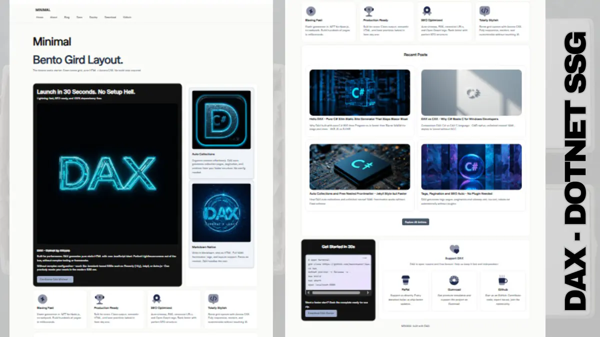

# DAX - Pure C# Slim Static Site Generator

> **Zero bloat. No Node. No Blazor overhead. Just `dotnet run` and you ship.**

Docs: [https://dax.axcora.com](https://dax.axcora.com)

Run Demo: [https://dax.axcora.com/minimal/](https://dax.axcora.com/minimal/)



DAX is a blazing-fast, file-based Static Site Generator written in **pure C# (.NET 9)**. Inspired by the simplicity of Jekyll  / 11ty and the power of CAX, DAX treats **every folder in `content/` as an automatic collection**, with **built-in pagination, tags, nested frontmatter, and YAML support** - all without Razor, Blazor, or `node_modules`.

```
content/posts/  -> collections.posts (auto)
content/projects/ -> collections.projects (auto)
_data/config.yaml -> config.list (auto)
```

---

### Support This Project

DAX is open source and free forever. If you find it useful, please consider supporting:

**GitHub:**
[https://github.com/sponsors/mesinkasir](https://github.com/sponsors/mesinkasir)

**PayPal:**
[https://www.paypal.com/cgi-bin/webscr?cmd=_s-xclick&hosted_button_id=JVZVXBC4N9DAN](https://www.paypal.com/cgi-bin/webscr?cmd=_s-xclick&hosted_button_id=JVZVXBC4N9DAN)

**Gumroad:**
[https://creativitaz.gumroad.com/coffee](https://creativitaz.gumroad.com/coffee)

Your support helps us maintain, improve, and add more features to DAX.


---

## Quick Start (CMD Only - No PowerShell)

### Dotnet .NET SDK installation 

Download Dotnet: https://dotnet.microsoft.com/download

Cek version 
```
dotnet --version
```

Optional Generate binary
```
#windows 
dotnet publish -c Release -r win-x64 --self-contained -o bin

#Linux
dotnet publish -c Release -r linux-x64 --self-contained -o bin

#macOS
dotnet publish -c Release -r osx-arm64 --self-contained -o bin
```

### Project Installation

#### Slim Version

```bat
gti clone https://github.com/mesinkasir/dax
cd dax
dotnet run -- build
dotnet run -- start
:: Open http://localhost:8080/
```

#### Dax Version

```bat
gti clone https://github.com/mesinkasir/dax
cd dax
dax build
dax start
:: Open http://localhost:8080/
```

---

## Project Structure

```
dax/
├── Program.cs              # Single-file SSG engine
├── Dax.csproj              # net9.0, PublishSingleFile
├── README.md
├── LICENSE (MIT)
├── .gitignore
├── .github/
│   └── workflows/
│       └── build.yml       # CI: build + test
│       └── deploy.yml      # Github Pages Deploy
├── _data/                  # Global data (auto-loaded)
│   ├── metadata.json       # site.title, site.url
│   ├── config.yaml         # Free YAML - nested list support
│   └── nav.json
├── content/                # File-based content (auto collections)
│   ├── index.md            # /  (free frontmatter: hero, image, etc)
│   ├── tags.md             # /tags/ (auto tags list)
│   ├── posts.md            # /posts/ controller -> collection: posts, pagination: 6
│   └── posts/
│       ├── hello.md        # /posts/hello/ - tags: [csharp, dax]
│       └── second.md
├── templates/
│   ├── layouts/
│   │   ├── base.dax        # Base layout
│   │   ├── home.dax        # Home + hero.list, config.list
│   │   ├── posts-list.dax  # Uses pagination.items
│   │   ├── post.dax        # Single post + prev_post/next_post
│   │   ├── tag.dax         # Single tag page
│   │   └── tags-list.dax   # All tags index
│   └── partials/
│       ├── header.dax      # 
│       ├── footer.dax
│       └── seo.dax
├── public/
│   └── css/style.css
└── site/                   # Generated (gitignored)
    ├── index.html
    ├── posts/
    ├── tags/
    ├── sitemap.xml
    ├── robots.txt
    └── rss.xml
```

---

## Frontmatter - Free & Nested

Any key you write in frontmatter becomes available in template:

```md
---
title: Home
layout: home.dax
hero:
  title: Hello DAX
  description: Slim SSG
  list:
    - name: Blog
      url: /posts/
      meta:
        icon: star
---
Welcome!
```

Template:
```dax
<h1>{{ hero.title }}</h1>

  {{ item.name }} - {{ item.meta.icon }}

```

Supports **unlimited nesting**: `hero.list[0].meta.nested.deep`

---

## Collections - Automatic

Every subfolder in `content/` is a collection. No config needed.

- `content/posts/*.md` -> `collections.posts`
- `content/projects/*.md` -> `collections.projects`

Controller file `content/posts.md`:
```md
---
collection: posts
pagination: 6
layout: posts-list.dax
---
```

In `posts-list.dax`:
```dax

  <a href="{{ post.url }}">{{ post.title }}</a>

Page {{ pagination.current_page }}/{{ pagination.total_pages }}
<a href="{{ pagination.prev_url }}">Prev</a>
<a href="{{ pagination.next_url }}">Next</a>
```

---

## Tags System

Add `tags: [csharp, dax]` in frontmatter.

- `/tags/` -> list all tags (`all_tags` with name, slug, count, url)
- `/tags/csharp/` -> posts with tag

`tags-list.dax`:
```dax

  <a href="{{ t.url }}">{{ t.name }} ({{ t.count }})</a>

```

---

## Data Files - JSON + YAML

`_data/` auto-loaded as global variables:

- `_data/config.yaml` -> `{{ config.site_name }}`, ``
- `_data/metadata.json` -> `{{ metadata.title }}`, `{{ site.url }}`

Supports: `.json`, `.yaml`, `.yml` with nested objects & list of objects.

---

## Templating (DAX Language)

- `{{ variable }}` , `{{ nested.key }}`, `{{ hero.list }}`
- `...` + `limit:3`
- `` shorthand also works
- `...`, ``
- ``
- Layout chain: frontmatter `layout: base.dax` -> `{{ content }}`

All layouts and partials support nested free variables.

---

## Why Open Source This?

Blazor/Razor ecosystem is heavy for content sites. DAX proves C# can be slim:

- **1 file** `Program.cs` ~800 lines
- **No dependencies** - only BCL + System.Text.Json
- **< 200ms build** for 100 pages
- **CMD native** - no PowerShell, no Node, no VS Code required

Perfect for: blogs, docs, portfolios, landing pages, GitHub Pages.

---

### Support This Project

DAX is open source and free forever. If you find it useful, please consider supporting:

**GitHub:**
[https://github.com/sponsors/mesinkasir](https://github.com/sponsors/mesinkasir)

**PayPal:**
[https://www.paypal.com/cgi-bin/webscr?cmd=_s-xclick&hosted_button_id=JVZVXBC4N9DAN](https://www.paypal.com/cgi-bin/webscr?cmd=_s-xclick&hosted_button_id=JVZVXBC4N9DAN)

**Gumroad:**
[https://creativitaz.gumroad.com/coffee](https://creativitaz.gumroad.com/coffee)

Your support helps us maintain, improve, and add more features to DAX.
